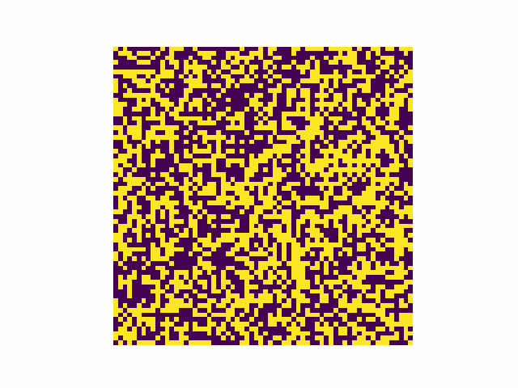

# GoRaBoN
A small implementation of Random Boolean Networks evolving in time.



## Description
After having seen [this video](https://www.youtube.com/watch?v=mCML2B94rUg), I felt inspired and I decided to implement a small, similar project to understand better this model and also as an excuse to practice with **Golang** :wink:

## Algorithm parameters
There are 3 values to play with in your experiments:

```
EPOCHS: how many time units the model evolves
LINKS : how many neighbors each node has in the DiGraph
NODES : how many nodes in the DiGraph
```

Notice that, in order to produce a squared image, `NODES` should be a perfect square and also a power of 2, while links whould be the exponent of the latter. To summarize in a simple equation:

$$NODES = 2^{LINKS}$$

## Getting started
First of all you have to clone this repository:
```
git clone https://github.com/A-725-K/GoRaBoN.git
```

Than you have to set your desired parameters in file `main.go` and launch it with the following command:
```
go run main.go
```

Finally, to get an animated gif like the one at the beginning of this *README*, you have to install the requirements and launch the *Python* script in the directory *plot*:
```
cd plot
pip install -r requirements.txt
python3 plot_results.py
```

Enjoy yourself! :smile:

## Author

<ul>
    <li><b>Andrea Canepa</b> - Computer Science, UNIGE</li>
</ul>
